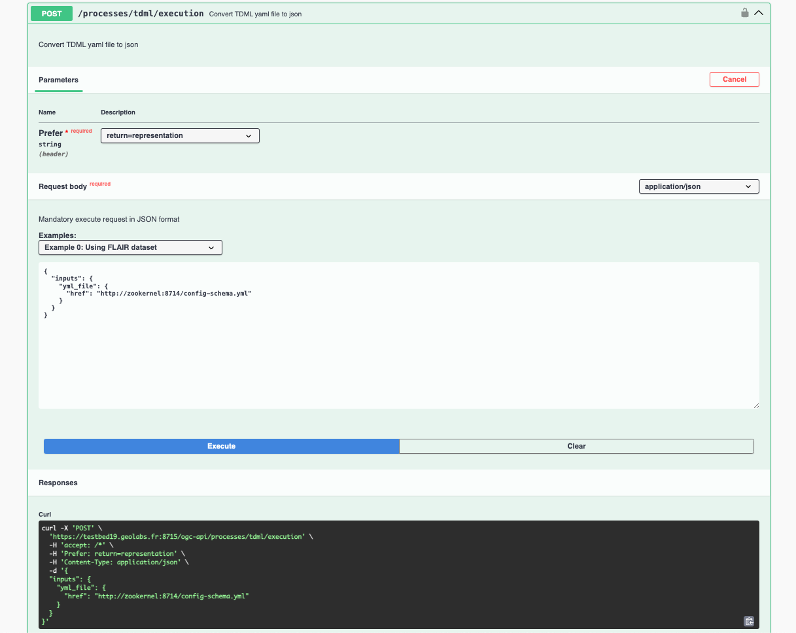

<!--
 * @Author: RuixiangLiuWHU lrx_lucky@whu.edu.cn
 * @Date: 2023-05-30 09:57:22
 * @LastEditors: RuixiangLiuWHU lrx_lucky@whu.edu.cn
 * @LastEditTime: 2023-12-19 10:20:42
 * @FilePath: \TrainingDML-AI_SWG\Implementations\README.md
 * @Description: 这是默认设置,请设置`customMade`, 打开koroFileHeader查看配置 进行设置: https://github.com/OBKoro1/koro1FileHeader/wiki/%E9%85%8D%E7%BD%AE
-->
# Implementations

work-in-progress

This page provides a list of implementations based on the OGC Training Data Markup Language for Artificial Intelligence (TrainingDML-AI) Standard. These implementations are designed to support the adoption and utilization of the TrainingDML-AI Standard across different platforms and applications. They offer a variety of tools, libraries, and APIs that enable users to work with training data in a standardized and interoperable manner. Whether you need to manage, annotate, share, or analyze training data for AI purposes, these implementations provide the necessary resources and functionalities to support your workflow.

## Contribution

If you have any implementations or contributions related to TrainingDML-AI, we welcome pull requests to update this page and add your contributions. You can provide more detailed information about your implementation in a subfolder. Please provide your email address so that we can contact you for page updates or any questions.

## PyTDML Implementation

[PyTDML](https://github.com/TrainingDML/pytdml) is a pure python parser and encoder for training datasets based on OGC Training Data Markup Language for AI standard.

Additionally, PyTDML is currently in the process of designing and implementing a pipeline service that enables the entire workflow from sample loading to sample consistency handling, sample transformation, and iterative training. We have designed user-friendly APIs that adhere to the OGC TrainingDML-AI Standard. With these APIs, users can automate the process of feeding TrainingDML-AI-encoded datasets into deep learning frameworks such as PyTorch, TensorFlow, and others.

## TrainingDML-AI STAC Extension Implementation

[TrainingDML-AI STAC Extension](https://github.com/TrainingDML/trainingdml-ai-extension) is designed as an extension to the SpatioTemporal Asset Catalog (STAC) specification. It builds upon the STAC specification and specifically addresses the requirements for geospatial machine learning training data and introduces additional fields and metadata concepts to formalize the information model of training data within the STAC framework.The extension expands upon the core STAC specification to accommodate the specific needs of training data, enabling interoperability and facilitating effective management and utilization of geospatial machine learning training datasets within the STAC ecosystem.
Now you can find the TrainingDML-AI Extension in the [STAC GitHub repository](https://stac-extensions.github.io/). The current maturity level is Proposal, and the release version is 1.0.0.

## LuojiaSet TrainingDML-AI Server Implementation

[LuojiaSet](http://58.48.42.237/luojiaSet) has implemented the TrainingDML-AI Standard and utilized it to encode the data within the LuojiaSet dataset and customized code was developed to prototype the use cases of dataset.

This implementation allows for retrieving the complete encoded content of the corresponding dataset by using the dataset record ID.

## PIE (Pixel Information Expert) Engine Online Dataset Implementation

[The PIE engine](https://engine.piesat.cn/)'s online model training module has implemented support for TrainingDML-AI encoding format in dataset import, as well as dataset export using the TrainingDML-AI format allowing users to easily upload their datasets to the platform for training purposes.

This implementation also ensures the integrity and effectiveness of the datasets used for training. By validating the data format, the platform can confirm that the datasets adhere to the required structure and standards. You can find the introduction [here](https://github.com/TrainingDML/ImplementationCaseOfPIE).

## Pixalytics Plastics Detection Dataset Implementation

The implementation is based on work undertaken as part of the OGC Testbed activities, where Python code was developed to catalog a Machine Learning dataset that has been extended to use the [PyTDML](https://github.com/TrainingDML/pytdml) to store the metadata in the TrainingDML-AI format.

## GeoLabs TDML-as-a-service Implementation

In OGC Testbed-19: Machine Learning Models Engineering Report, GeoLabs made an implementation:

/tdml — TDML-as-a-service: Endpoint implementing generation of training data encodings in a JSON file format based on the OGC Training-DML for AI Standard.

## The First Institute of Photogrammetry & Remote Sensing, MNR Classification Task Implementation

The First Institute of Photogrammery & Remote Sensing, MNR Uses training data in TrainingDML-AI format and performs training tasks (semantic segmentation and change detection) based on the TrainingDML-AI Standard.

The main training process can be outlined as follows:

1. Utilizing the LuojiaSet's API to incorporate the category system of MNR into the library, supporting a multi-level category system.
2. Leveraging the LuojiaSet's API to parse the datasets comprehensively, encompassing both metadata and raw data parsing.
3. Utilizing the LuojiaSet's API to transform the datasets into the TrainingDML-AI format.
4. Uploading the PyTDML installation package.
5. Developing deep learning code wherein PyTDML reads the training data in the TrainingDML-AI format and undergoes training tasks.