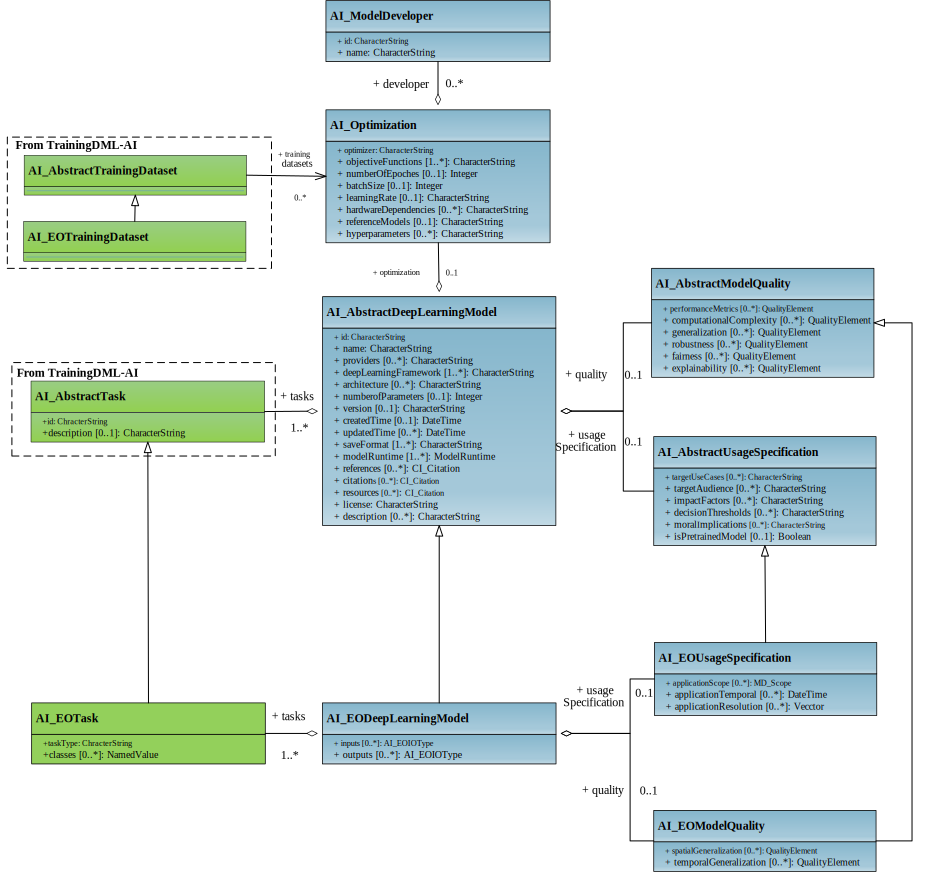

# TDML-Model

## 1. Abstract
The TDML-Model (or the deep learning model language for AI) of TrainingDML-AI aims to develop the UML model and encoding schema to describe geospatial deep learning models. The model-extension will be conformed with TrainingDML-AI and OGC standards baseline to facilitate the sharing, exchange, reusability, and interoperability of models in the web environment.

## 2. Scope of Work
Deep learning has significantly contributed to geospatial analysis and revolutionized how we understand and extract information from geospatial data. Nowadays, abundant deep learning models are trained daily to accomplish various geospatial tasks, such as land cover and land use mapping, change detection, road network extraction, geospatial data fusion, etc. However, the information of most models has not been described and recorded standardized, which brings difficulties to the sharing and reusing of models and is not conducive to interoperability and reusability. 
Hence, the TDML-Model is proposed to develop the UML model to standardize the deep learning model description by defining the metadata of deep learning models, such as model framework, provenance, invocation methods, model quality, etc., so that the models can be shared and managed in a unified framework. 
The model-extension will undertake the following work actions around geospatial deep learning models:
- Design the UML model and encoding schema of Geospatial Deep Learning Model Language, enhance the interoperability and usability of models for various geospatial deep learning tasks;
- Define the metadata and hyperparameter description of deep learning framework (e.g., PyTorch, TensorFlow) and model invocation methods;
- Define the provenance model for deep learning models by describing the training datasets (conforming to OGC TDML-AI), the model optimization process, and the model developers.
- Define the description of tasks and scenarios to which the model can be applied. 
- Define the description of the model quality evaluation (e.g., performance metrics, generalization, robustness, ...);
- Define the description of model usage specification for helping models to be used in appropriate scenarios.
- Best practices for documenting, storing, evaluating, managing, and sharing the geospatial deep learning models.

## 3. Normative References
The following normative documents contain provisions that, through reference in this text, constitute provisions of this document. For dated references, subsequent amendments to, or revisions of, any of these publications do not apply. For undated references, the latest edition of the normative document referred to applies.

[ISO 19157-1 Geographic information — Data quality — Part 1: General requirements.](https://www.iso.org/standard/78900.html)

## 4. UML Model
The UML model is the normative definition of the TDML model-extension Conceptual Model. The figures in this section were software generated from the UML model. As such, this section provides a normative representation of the TDML model-extension Conceptual Model.

### 4.1	Overview of the UML model
The UML model is presented with core concepts in Figure 1. The following describes the core concepts:
- AI_DeepLearningModel: This concept represents a deep learning model;
- AI_Optimization: This concept defines the information about how the deep learning model was trained;
- AI_ModelQuality: This concept describes the quality of the deep learning model;
- AI_TrainingDataset: This concept is employed from TrainingDML-AI and is used to describe the datasets on which model was trained;
- AI_Task: This concept is employed from TrainingDML-AI and is used to describe what tasks the model can be used for;
- AI_UsageSpecification: This concept includes essential references for model reuse.

 

 Figure 1. Core concepts.

The full overview of concrete classes and attributes are presented in Figure 2. Concepts related to the EO AI/ML applications are defined as classes extended from abstract classes. Each core concept with related classes will be described in the rest subsections.

 Figure 2. UML model

 
 

 Figure 3. Data Type in UML Model

### 4.2 AI_DeepLearningModel
A deep learning model is represented as AI_AbstractDeepLearningModel. A set of basic attributes are defined for AI_AbstractDeepLearningModel. These include the identification, name for findability; providers, references, citations, and license for copyright; architecture, parameters, inputs, outputs, architecture, save format, dependencies, and resources for reusability; version for update. These basic attributes can also be seen as a minimum set of metadata to define a simple payload.

#### 4.2.1 Class Definitions
Table 1. Classes defined in AI_DeepLearningModel
| **Name**                         | **Description**                                                  |
| ---------------------------- | ------------------------------------------------------------ |
| AI_AbstractDeepLearningModel | AI_AbstractDeepLearningModel defines the basic concepts and components of a deep learning  model. |
| AI_EODeepLearningModel       | AI_EODeepLearningModel describes attributes  specific to a EO deep learning model. |

Table 2. Data types defined in AI_DeepLearningModel
| **Name**                           | **Description**                                                  |
| ------------------------------- | ------------------------------------------------------------ |
| AI_AbstractIOType  \<\<DataType>> | AI_AbstractIOType  defines the basic concepts of inputs and outputs format of the deep learning models. |
| AI_EOIOType  \<\<DataType>>       | AI_EOIOType defines attributes of inputs and outputs specific to the EO deep learning models. |

#### 4.2.2 Data Dictionary
Table 3. Attributes of AI_AbstractDeepLearningModel (Class)
| **Attribute**         | **Value type and multiplicity** | **Definition**                                               |
| --------------------- | ------------------------------- | ------------------------------------------------------------ |
| id                    | CharacterString  [1..1]         | Identification  of the deep learning model.                  |
| name                  | CharacterString  [1..1]         | Name  of the deep learning model.                            |
| providers             | CharacterString  [0..*]         | People  or organizations who provide the deep learning model. |
| deepLearningFramework | CharacterString  [1..*]         | Deep learning  framework of the deep learning model. For example PyTorch, TensorFlow. |
| architecture            | CharacterString  [0..*]         | Neural  network architecture of the deep learning model. |
| version               | CharacterString  [0..1]         | Version  number of the deep learning model.                  |
| saveFormat            | CharacterString  [1..*]         | Save  format of the deep learning model. For example ONNX, TensorRT. |
| softwareDependencies  | CharacterString  [0..*]         | Software  requirement that the deep learning model relies on to function correctly. |
| hardwareDependencies  | CharacterString  [0..*]         | Hardware  requirement that the deep learning model relies on to function correctly. |
| modelURL              | CharacterString [1..*]                       | URLs of the deep learning model.                             |
| inputs                | AI_AbstractIOType [0..*]         | The  information of the inputs of the deep learning model.   |
| outputs               | AI_AbstractIOType [1..*]         | The  information of the outputs of the deep learning model.  |
| modelHandler          | CharacterString  [1..*]                | Model usage handler.        |
| parameters            | CharacterString  [0..1]         | Parameters required for model inference.  |
| references            | CharacterString  [0..*]         | The  literatures that the deep learning model is referenced. |
| citations             | CharacterString  [0..*]         | Citations  when using the deep learning model.               |
| resources             | CharacterString  [0..*]         | Additional  resources related to the deep learning model, for example GitHub link. |
| license               | CharacterString  [1..1]         | License  description of the deep learning model.             |
| description           | CharacterString  [0..*]         | Other  description of the deep learning model.               |

Table 4. Attributes of AI_EODeepLearningModel (Class)
| **Attribute** | **Value type and multiplicity** | **Definition**                                               |
| ------------- | ------------------------------- | ------------------------------------------------------------ |
| inputs        | AI_EOIOType[0..*]               | The  information of the inputs of the EO deep learning model. |
| outputs       | AI_EOIOType[1..*]               | The information  of the outputs of the EO deep learning model. |

Table 5. Attributes of AI_AbstractIOType (DataType)
| **Attribute** | **Value type and multiplicity** | **Definition**                                               |
| ------------- | ------------------------------- | ------------------------------------------------------------ |
| meanNormalization            | Float  [0..*]         | The mean used to normalize the input data.                    |
| stdNormalization      | Float [0..*]         | The standard deviation used to normalize the input data. |
| dataSources    | CI_Citation [0..*]                | Citation  of data sources.   |
| dataFormat   | CharacterString [0..*]           |  The data type of the input/output data, for example image, text, video.             |
| dataType  | CharacterString [0..*]           | Basic data type (e.g.: int, float, double).                |
| dataShape  | Integer [0..*]           | The shape of the input or output tensor.              |
| dimOrder   | CharacterString [0..*]           | The order of the dimensions by name.                |
| description   | CharacterString [0..*]           | Other  description of the input/output data.                 |

Table 6. Attributes of AI_EOIOType (DataType)
| **Attribute**     | **Value type and multiplicity** | **Definition**                                               |
| ----------------- | ------------------------------- | ------------------------------------------------------------ |
| bands             | MD_Bands [0..*]                  | Description  of the image bands in the EO input/output data. |
| imageSize         | CharacterString [0..1]           | Size  of the EO input/output data.     |

### 4.3 AI_Optimization
AI_Optimization records information about the model training process.

#### 4.3.1 Class Definitions
Table 7. Classes defined in AI_Optimization
| **Name**        | **Description**                                              |
| --------------- | ------------------------------------------------------------ |
| AI_Optimization | AI_Optimization defines the concepts to train the neural network. |
| AI_TrainingDataset | AI_TrainingDataset is employed from TrainingDML-AI to record the dataset that the model was trained on. |

#### 4.3.2 Data Dictionary
Table 8. Attributes of AI_Optimization (Class)
| **Attribute**        | **Value type and multiplicity** | **Definition**                                               |
| -------------------- | ------------------------------- | ------------------------------------------------------------ |
| optimizer            | CharacterString [1..1]           | The optimization  algorithms to minimize the objective function during the training process,  for example stochastic gradient descent. |
| objectiveFunction    | CharacterString [1..*]           | A  mathematical function that quantifies the difference between predicted and  actual values. |
| numberOfEpochs       | Int [0..1]                       | Number  of epochs, where an epoch is a complete iteration through the entire training  dataset for training. |
| batchSize            | Int [0..1]                       | Batch  size defines the number of samples used in one iteration to train a neural  network. |
| learningRate         | CharacterString [0..1]           | A parameter  in the optimizer that determines the step size at each iteration. |
| hardwareDependencies | CharacterString [0..*]           | Hardware  requirement to train the deep learning model.      |
| pretrainedModels     | CharacterString [0..*]           | Pretrained  models that the training process relies on.      |
| hyperparameters      | CharacterString [0..*]           | Other hyperparameters  to train the deep learning model.     |

### 4.4	AI_ModelQuality
The quality of a deep learning model refers to its performance and effectiveness in solving a specific task or problem. Evaluating the quality of a deep learning model involves considering various aspects and metrics. Here are some key factors and elements that contribute to assessing the quality of a deep learning model: accuracy, computational complexity, generalization, robustness, fairness, and explainability. AI_AbstractModelQuality records these elements to express the quality of the deep learning model. The quality description of the deep learning model can leverage the quality elements defined in QualityElement from ISO 19157. 
Furthermore, AI_EOModelQuality is derived from AI_AbstractModelQuality, and it employes spatialGeneralizability and temporalGenerability to represent the generability of EO models in spatial and temporal dimensions.

The data quality element of ISO 19157 is described by a reference to a quality measure, an evaluation method, a quality result, and a metaquality element, which are shown in Figure 3. Measure reference provide an identifier of a measure fully described elsewhere. Evaluation method describes those procedures and methods which are applied to the geographic data to arrive at a data quality result. Quality result is provided for each data quality element. This could be a quantitative result, a conformance result, a descriptive result or a coverage result. A metaquality element is described by the same descriptors as for the quality element: measure, evaluation method and result.

 Figure 3. Data quality element descriptors.

#### 4.4.1 Class Definitions
Table 9. Classes defined in AI_ModelQuality
| **Name**                | **Description**                                              |
| ----------------------- | ------------------------------------------------------------ |
| AI_AbstractModelQuality | AI_AbstractModelQuality defines the basic quality elements of deep learning models. |
| AI_EOModelQuality       | AI_EOModelQuality defines quality elements specific to EO deep learning models. |

#### 4.4.2 Data Dictionary
Table 10. Attributes of AI_AbstractModelQuality (Class)
| **Attribute**           | **Value type and multiplicity** | **Definition**                                               |
| ----------------------- | ------------------------------- | ------------------------------------------------------------ |
| performanceMetrics      | QualityElement [1..*]            | Performance measures of the deep learning model measured on a specific dataset.                        |
| computationalComplexity | QualityElement [0..*]            | How  efficiently a deep learning model performs tasks while utilizing  computational resources such as CPU/GPU, memory, and energy. |
| generalization          | QualityElement [0..*]            | The  ability to perform well on data it has never seen before. |
| robustness              | QualityElement [0..*]            | The  ability to maintain their level of performance, as intended by their  developers, under any condition and circumstances. |
| fairness                | QualityElement [0..*]            | Equitable  and unbiased treatment of different individuals or groups. |
| explainability          | QualityElement [0..*]            | The  property that the important factors influencing a decision can be expressed  in a way that humans can understand. |

Table 11. Attributes of AI_EOModelQuality (Class)
| **Attribute**          | **Value type and multiplicity** | **Definition**                                               |
| ---------------------- | ------------------------------- | ------------------------------------------------------------ |
| spatialGenerability  | QualityElement [0..*]            | The  ability to perform well on data from unseen geographic regions. |
| temporalGenerability | QualityElement [0..*]            | The  ability to perform well on data from unseen time period. |

### 4.5 AI_UsageSpecification
AI_UsageSpecification is an important reference for the scope and usage methods of the model. It records the application scope of the model, the usage recommendations and ethical considerations for model usage. Additionally, AI_EOUsageSpecification is devired from AI_AbstractUsageSpecification to record specifications for EO deep learning models.

#### 4.5.1 Class Definitions
Table 12. Classes defined in AI_UsageSpecification
| **Name**                | **Description**                                              |
| ----------------------- | ------------------------------------------------------------ |
| AI_AbstractUsageSpecification | AI_AbstractUsageSpecification defines general usage specifications for deep learning models. |
| AI_EOUsageSpecification      | AI_EOUsageSpecification defines usage specifications specific to EO deep learning models. |

#### 4.5.2 Data Dictionary
Table 13. Attributes of AI_AbstractUsageSpecification (Class)
| **Attribute**           | **Value type and multiplicity** | **Definition**                                               |
| ----------------------- | ------------------------------- | ------------------------------------------------------------ |
| targetUseCases      | CharacterString [0..*]            | Target use scenarios. |
| targetAudience | CharacterString [0..*]            |Target users.   |
| impactFactors          | CharacterString [0..*]            | Factors that may have an impact on model performance and predictive effectiveness. |
| decisionThresholds              | CharacterString [0..*]            | Threshold reference point for confidence in model output results. |
| moralImplications                | CharacterString [0..*]            | Possible ethical implications of the use of models. |
| isPretrainedModel          | Boolean [0..1]            | Whether the model can be used as a pre-trained model. |

Table 14. Attributes of AI_EOUsageSpecification (Class)
| **Attribute**           | **Value type and multiplicity** | **Definition**                                               |
| ----------------------- | ------------------------------- | ------------------------------------------------------------ |
| applicationScope      | MD_Scope [0..*]            | A complementary description of the deep learning model application scope.  |
| applicationTemporal | DateTime [0..*]            | A complementary description of the deep learning model application time period.   |
| applicationResolution          | Float [0..*]            | A complementary description of the deep learning model application resolution. |

### 4.6	AI_TrainingDataset
AI_TrainingDataset records the dataset needed to train the deep learning model. The training dataset description can leverage the AI_AbstractTrainingDataset and AI_EOTrainingDataset defined in TrainingDML-AI.

### 4.7	AI_Task
AI_Task refers to a specific problem or objective addressed using deep learning techniques and models. The task description can leverage the AI_AbstractTask and AI_EOTask defined in TrainingDML-AI.

## 5. Use Cases
_Will be revised soon_
Table 15. A collection of some encoded deep learning models
|Model Name|Training Dataset|Description|JSON|Download|
|-|-|-|-|-|
|UPerNet_LULC|Five-Billion-Pixels|A land use land cover classification model based on UPerNet with 25 classes.|[UPerNet_LULC.json](use-cases/UPerNet_LULC.json)|[UPerNet_LULC.onnx](https://drive.google.com/file/d/1AcsTRsgHAwOROfq1qsa709kdKHleFmE0/view?usp=drive_link)|
|CropLandExtraction_GF2|-|Crop land extraction model on GF-2 images.|[CropLandExtraction_GF2.json](use-cases/CropLandExtraction_GF2.json)|[CropLandExtraction_GF2.onnx](https://drive.google.com/file/d/1x7s3LWbHln2bj_X54jU9Il7Wi_mB5mZu/view?usp=sharing)|