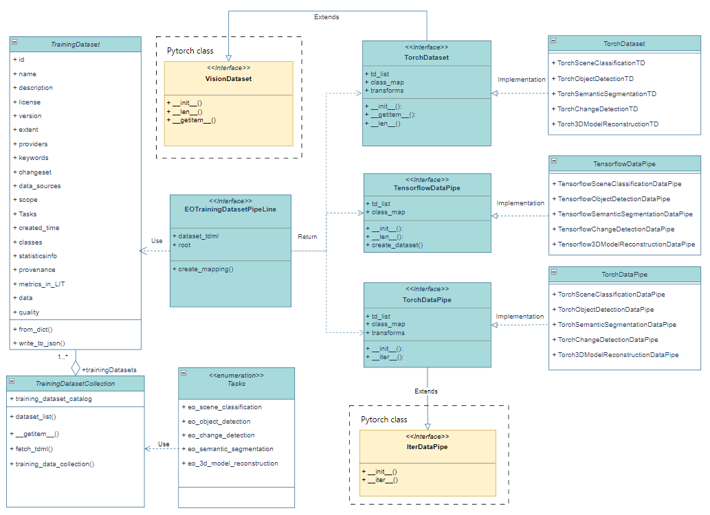

== Introduction

PyTDML is a pure python parser and encoder for training datasets based on OGC Training Data Markup Language for AI standard. Welcome to the PyTDML tutorial, your guide to work with Training Data Markup Language (TDML) for Artificial Intelligence using Python. 

=== What is TDML?

The Training Data Markup Language for Artificial Intelligence (TrainingDML-AI) SWG is chartered to develop the UML model and encodings for geospatial Machine Learning training data. In machine learning, training data is the dataset used for training and validation of machine learning models. The geospatial training data categories will include, but are not restricted to, remote sensing imagery, moving features (e.g., vehicle trajectories), and related spatial content. The SWG will define a UML model and encodings consistent with the OGC standards baseline to exchange and retrieve the training data in the Web environment. The SWG will start from the JSON implementation. Once the UML and JSON encoding are well accepted, the SWG will work on the XML encoding as the current OGC baseline. This standard will provide more detailed metadata for formalizing the information model of training data.

=== Main Functions of PyTDML

PyTDML is a framework or library used for processing and managing training datasets. The following figure shows the organizational structure of abstract classes implemented by PyTDML.

The main functions of PyTDML can be summarized as follows:

 - Datasets definition and management: PyTDML allows users to organize and describe training datasets by defining classes such as _TrainingDataset_ and _Task_. Users can manually input metadata information and integrate training data from different sources into a _TrainingDataset_ object. This includes information such as the ID, name, description, task type, data list, version, creation and update time, provider, keywords, data source, and specific category of the dataset.
 - Task definition: In PyTDML, users can define different tasks including "Scene Classification" and "Semantic Segmentation", and provide detailed descriptions for these tasks. This helps to clarify the purpose and scenario of using the dataset, facilitating subsequent data processing and analysis.
 - Data pipeline: PyTDML has designed specific data pipeline routes for different Earth observation missions. Each data pipeline is responsible for loading the dataset required for the corresponding task. Within the same task type, data pipelines can use standardized loading logic to parse and process different datasets, which is due to the shared training sample composition patterns among these datasets. Therefore, cross dataset training sample utilization becomes feasible as data pipelines can consistently process and interpret training samples.
 - Data annotation and classification: PyTDML supports annotation and classification of training data. For example,
in remote sensing image datasets, specific categories such as "Airport", "Beach", "Bridge", etc. can be defined, and data can be organized through these categories.
 - Data standardization: By defining a unified format for the dataset (such as image size, band information, etc.), PyTDML helps to standardize data processing, thereby improving data consistency and comparability.
 - Metadata management: PyTDML emphasizes the importance of metadata and provides convenience for the long-term storage and reuse of datasets by detailing the metadata of the dataset, such as data source, creator, update time, etc.

Let's dive in and start exploring the world of standardized geospatial training data with PyTDML!

