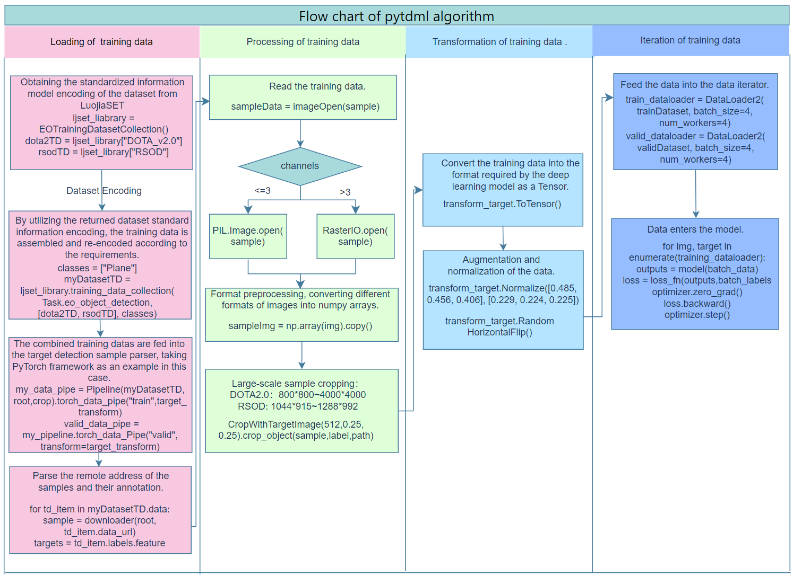

== PyTDML Use Case

Here we take the object detection datasets DOTA 2.0 and RSOD as examples to demonstrate the process using PyTDML.

DOTA2.0:

 - Number of plane instances: 11365
 - Image format: jpg
 - Image channels: 1 or 3
 - Image Size: 800 * 800 to 4000 * 4000

RSOD:

- Number of plane instances: 5374
- Image format: .jpg
- Image channels: 3
- Image Size: 1044 * 915 to 1288 * 992

The process of the case is illustrated in the following figure, which includes four steps: Loading of training data, Processing of training data, Transformation of training data, and Iteration of training data.

The code for implementing this case is shown below.

----
DOTA2_TD = EOTrainingDatasetcollection()["DOTA-v2.0"]
# Obtain metadata information of the DOTA-v2.0 dataset.
print("Load training dataset: " + DOTA2_TD.name)
print("Number of training samples: " + str(DOTA2_TD.amount_of_training_data))
print ("Number of classes: " + str(DOTA2_TD.number_of_classes))

RSOD_TD = EOTrainingDatasetcollection()["RSOD"]
my_dataset = EOTrainingDatasetcollection().training_data_collection(Task.eo_object_detection, [DOTA2_TD_TD, RSOD_TD], ["Plane"])

# Encapsulate the PyTorch dataset class.
my_pipeline = PipeLine(mydataset, path, crop=(800, 0.25, 0.25))
train_data_pipe = my_pipeline.torch_data_Pipe("train", transform=target_transform)
train_dataloader = DataLoader2(train_data_pipe, batch_size=4, num_workers=4, collate_fn=collate_fn)
valid_data_pipe = my_pipeline.torch_data_Pipe("valid", transform=target_transform)
valid_dataloader = DataLoader2(valid_data_pipe, batch_size=4, num_workers=4, collate_fn=collate_fn)

# Model training.
for epoch in range(num_epochs):
    for batch_data, batch_labels in train_dataloader:
        # Forward propagation.
        outputs = model(batch_data)
        loss = loss_fn(outputs, batch_labels)
        # Backward propagation and optimization.
        optimizer.zero_grad()
        loss.backward()
        optimizer.step()
    # Print the loss value for each epoch.
    print(f"Epoch{epoch+1}/{num_epochs}, Loss: {loss.item()}")

with torch.no_grad():
    for images, labels in valid_dataloader:
    # Compute accuracy and other evaluation metrics.
----