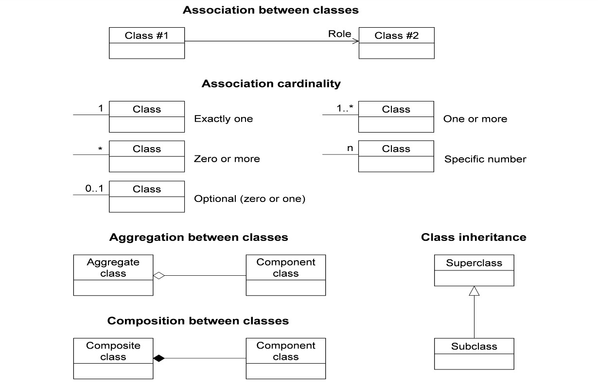

== Conventions

This section provides details and examples for any conventions used in the document. Examples of conventions are symbols, abbreviations, use of XML schema, or special notes regarding how to read the document.

=== Identifiers

The normative provisions in this specification are denoted by the URI:

http://www.opengis.net/spec/TrainingDML-AI-1/1.0

All requirements and conformance tests that appear in this document are denoted by partial URIs which are relative to this base.

=== Abbreviated terms

In this document the following abbreviations and acronyms are used or introduced:

* AI -- Artificial Intelligence
* DL -- Deep Learning
* EO -- Earth Observation
* ISO -- International Organization for Standardization
* JSON -- JavaScript Object Notation
* LC -- Land Cover
* LU -- Land Use
* ML -- Machine Learning
* OGC -- Open Geospatial Consortium
* RS -- Remote Sensing
* TD -- Training Data
* UML -- Unified Modelling Language
* XML -- Extensible Markup Language

=== UML Notation

The Standard is presented in this document through diagrams using the Unified Modeling Language (UML) static structure diagram. The UML notations used in this Standard are described in the diagram in Figure 1.

[[figure-uml-notation]]
.UML notation (see ISO TS 19103, Geographic information — Conceptual schema language).

All associations between model elements in the TrainingDML-AI Conceptual Model are uni-directional. Thus, associations in the model are navigable in only one direction. The direction of navigation is depicted by an arrowhead. In general, the context an element takes within the association is indicated by its role. The role is displayed near the target of the association. If the graphical representation is ambiguous though, the position of the role has to be drawn to the element the association points to.

The following stereotypes are used in this model.

* «DataType» defines a set of properties that lack identity. A data type is a classifier with no operations, whose primary purpose is to hold information.
* «CodeList» enumerates the valid attribute values. In contrast to Enumeration, the list of values is open and, thus, not given inline in the TrainingDML-AI UML Model. The allowed values can be provided within an external code list.