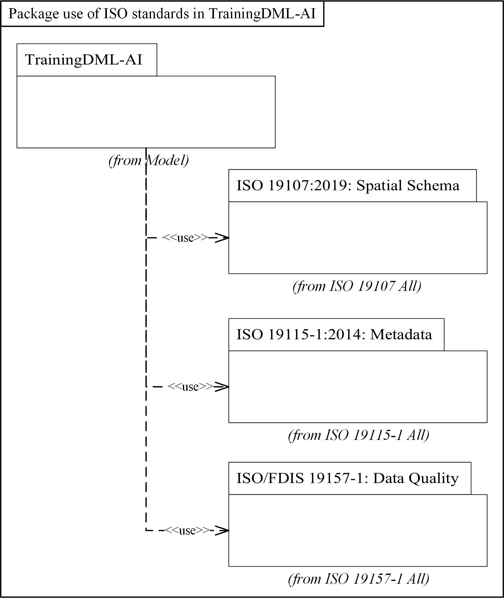
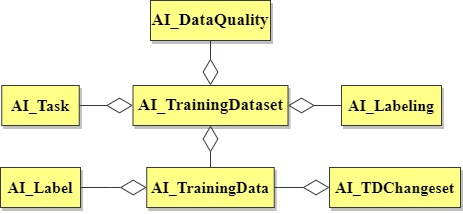
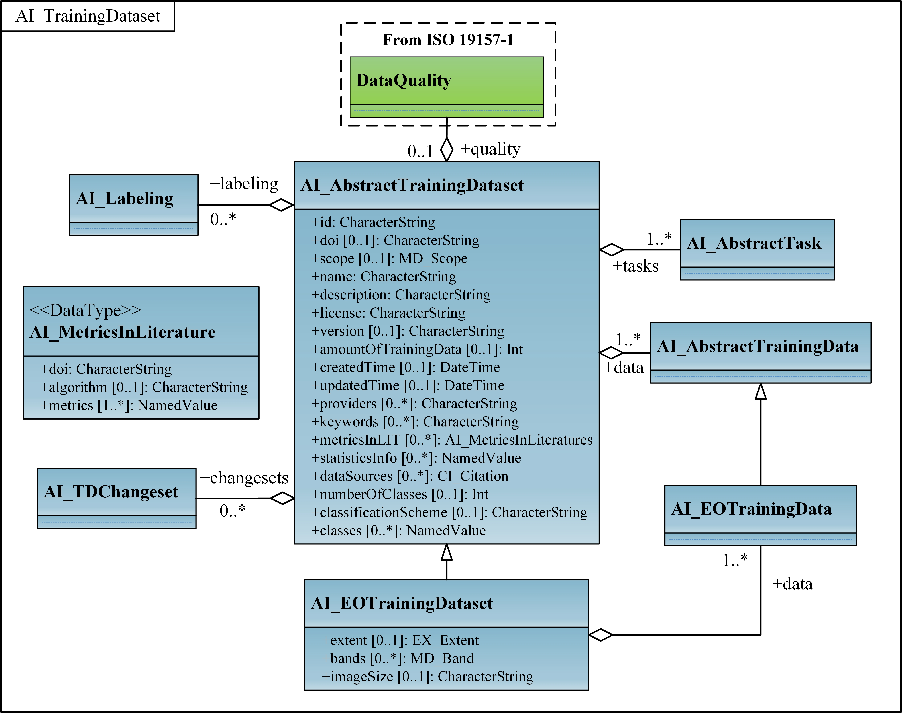
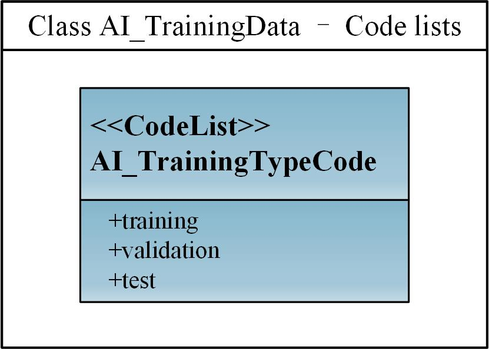
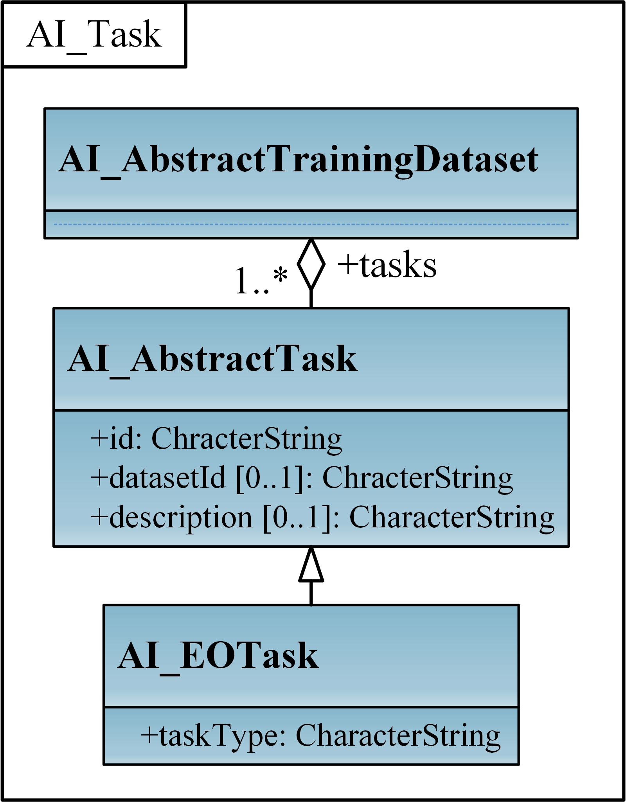
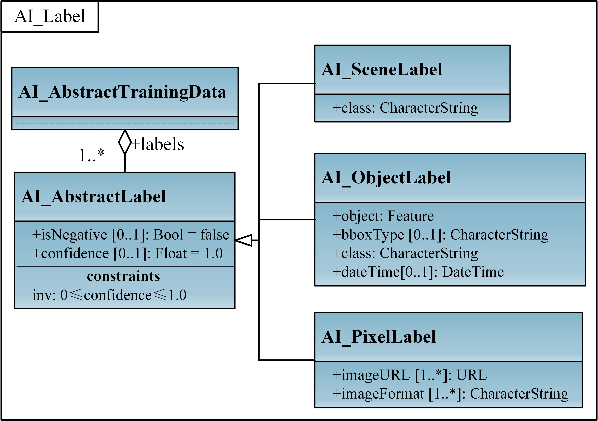
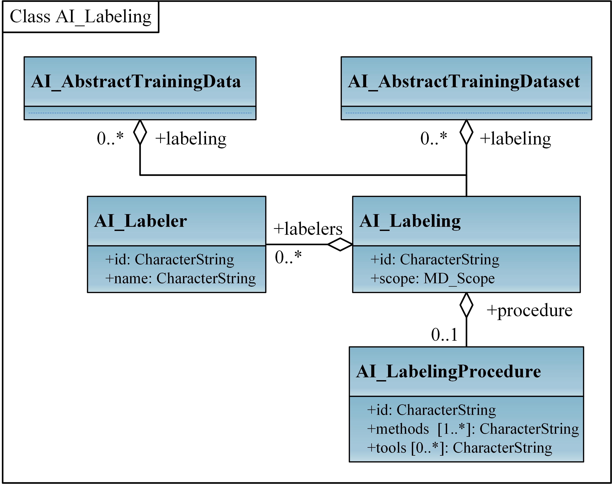
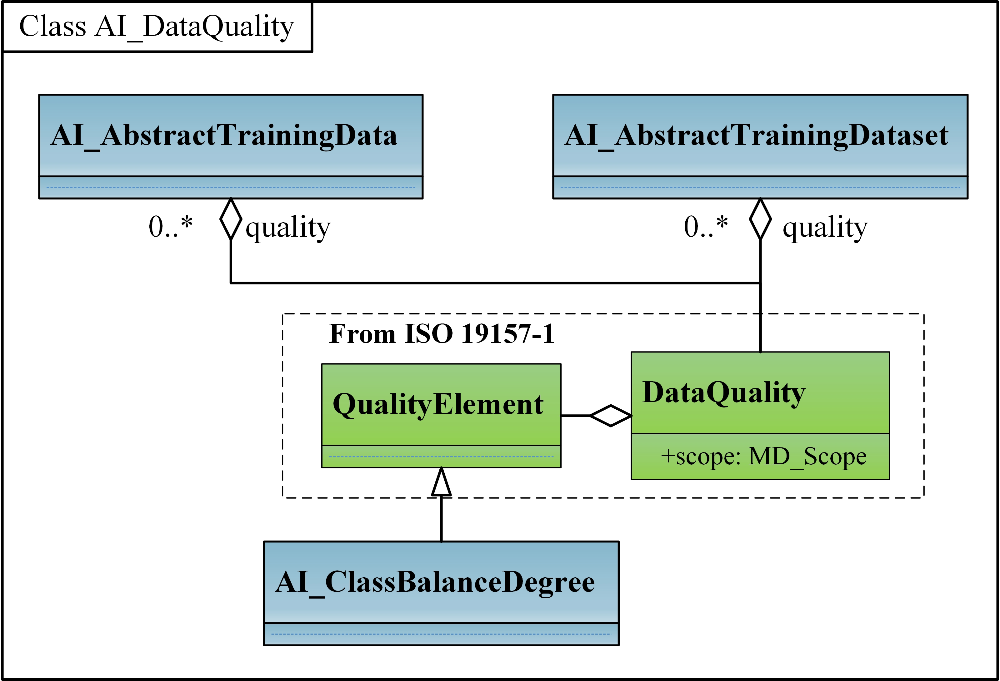

== TrainingDML-AI UML Model

The TrainingDML-AI UML model is the normative definition of the TrainingDML-AI Conceptual Model. The tables and figures in this section were software generated from the UML model. As such, this section provides a normative representation of the TrainingDML-AI Conceptual Model.

=== ISO dependencies

TrainingDML-AI builds on the ISO 19100 family of standards. The applicable standards are identified in Figure 3. Data dictionaries are included for all the ISO-defined classes explicitly referenced in the TrainingDML-AI UML model. These data dictionaries are provided for the convenience of the user. The ISO standards are the normative source.

[[figure-iso-dependencies]]
.Use of ISO Standards in TrainingDML-AI.

The ISO classes explicitly used in the TrainingDML-AI UML model are introduced in Table 1. Further details about these classes can be found in the Data Dictionary within Clause 8.

[[table-iso-dependencies]]
.ISO Classes used in TrainingDML-AI
|===
|Class Name |Description
|Feature |Abstraction of real world phenomena.
|MD_Band |Range of wavelengths in the electromagnetic spectrum.
|MD_Scope |The target resource and physical extent for which information is reported.
|EX_Extent |Extent of the resource.
|CI_Citation |Standardized resource reference.
|DataQuality |Quality information for the data specified by a data quality scope.
|QualityElement |Aspect of quantitative quality information.
|===

=== Overview of the UML model

The UML model is presented with core concepts in Figure 4, followed by the concrete classes in Figure 5. The following describes the core concepts:

* AI_TrainingDataset: This concept represents a collection of training samples, i.e. a training dataset.
* AI_TrainingData: This concept is an individual training sample in a training dataset.
* AI_Task: This concept is used to identify the task that the training dataset is used for. 
* AI_Label: This concept represents the label semantics for TD.
* AI_Labeling: This concept provides the provenance of how TD are created.
* AI_TDChangeset: This concept records types of TD changes between two versions of the training dataset.
* AI_DataQuality: This concept is associated with a training dataset to document its quality.

[[figure-core-concepts]]
.Core concepts.

The full overview of concrete classes and attributes are presented in Figure 5. Concepts related to the EO AI/ML applications are defined as classes extended from abstract classes. Each core concept with related classes will be described in the rest subsections.

[[figure-overview-uml-model]]
.Overview of the UML model.
image::figures/overview_uml_model.jpg[width="100%", align="center"]

=== AI_TrainingDataset

include::requirements/requirements_class_trainingdataset.adoc[]

An AI training dataset is represented as AI_AbstractTrainingDataset. Each training sample in the dataset is represented as AI_AbstractTrainingData. A set of basic attributes are defined at the collection level for AI_AbstractTrainingDataset. These include the identification, authorship, time for creation and update, AI tasks, number of training samples (amountOfTrainingData), label semantics (classes recording the available semantic classes), number of label classes, and statistics of training samples in each class (statisticsInfo). These basic attributes at the collection level can also be seen as a minimum set of metadata to define a simple payload. In this context, payload means the actual content that will be transmitted on the Web. They can be mapped to the MD_Metadata entity properties in ISO 19115, and thus delegate the metadata description via a metadata association to existing metadata standards.

The AI_EOTrainingDataset is defined to convey attributes specific to EO. For example, the data source (e.g., EO images), image size, band information, and spatial extent are defined in AI_EOTrainingDataset.

The UML diagram of the AI_TrainingDataset is illustrated in Figure 6.

[[figure-uml-trainingdataset]]
.UML diagram of AI_TrainingDataset.

==== Requirements

The following requirement defines the rules governing the implementation of the AI_TrainingDataset conceptual model as an implementation standard.

include::requirements/requirement_trainingdataset.adoc[]

==== Class definitions

.Classes defined in AI_TrainingDataset
[width="100%",cols="34%,66%",options="header",]
|===
|Name |Description
|AI_AbstractTrainingDataset |AI_AbstractTrainingDataset defines the basic concepts and components of different kinds of training dataset.
|AI_EOTrainingDataset |AI_EOTrainingDataset describes attributes specific to EO training dataset. For example, the data source, image size, band information, and spatial extent.
|===

.Data types defined in AI_TrainingDataset
[width="100%",cols="34%,66%",options="header",]
|===
|Name |Description
|
AI_MetricsInLiterature
\<<DataType>>
|AI_MetricsInLiterature records results of performance metrics achieved by AI/ML algorithms in the peer-reviewed literature.
|===

=== AI_TrainingData

include::requirements/requirements_class_trainingdata.adoc[]

The AI_AbstractTrainingData includes the source data and its corresponding labels, which focus on a compact modelling of individual training samples. When there is a need to identify the different uses/purposes, an optional attribute, the training type (training, validation, or test types), can be added at the individual level. The attribute datasetId helps identify samples from different training datasets.

The AI_EOTrainingData is defined to convey attributes specific to EO. It provides additional attributes, including spatial extent and date/time of the source EO inputs.

The UML diagram of the AI_TrainingData is illustrated in Figure 7.

[[figure-uml-trainingdata]]
.UML diagram of AI_TrainingData.
image::figures/uml_model_trainingdata.jpg[width="80%", align="center"]

The Code Lists provided for the AI_TrainingData are illustrated in Figure 8.

.Code lists from the AI_TrainingData.
[[figure-uml-trainingdata-codelist]]

==== Requirements

The following requirement defines the rules governing the implementation of the AI_TrainingData conceptual model as an implementation standard.

include::requirements/requirement_trainingdata.adoc[]

==== Class definitions

.Classes defined in AI_TrainingData
[width="100%",cols="34%,66%",options="header",]
|===
|Name |Description
|AI_AbstractTrainingData |AI_AbstractTrainingData defines the basic concepts and components of different kinds of training data.
|AI_EOTrainingData |AI_EOTrainingData describes attributes specific to EO training data. For example, spatial extent and date time of the source EO inputs.
|===

.Code list classes defined in AI_TrainingData
[width="100%",cols="34%,66%",options="header",]
|===
|Name |Description
|AI_TrainingTypeCode
\<<CodeList>>
|AI_TrainingTypeCode is a code list used to identify whether the individual data element is used for different purposes.
|===

=== AI_Task

include::requirements/requirements_class_task.adoc[]

Various AI/ML tasks in specific domains can have different organizing forms of TD, including source data and label representations. AI_EOTask is proposed by extending AI_AbstractTask to represent specific AI/ML tasks in the EO domain. The task type can refer to a particular type defined by an external category, such as scene classification or change detection. It specifies, for example, whether a remote sensing training dataset is used for scene classification, objection detection, land use or land cover, or change detection scenarios.

The UML diagram of the AI_Task is illustrated in Figure 9.

[[figure-uml-task]]
.UML diagram of AI_Task.

==== Requirements

The following requirement defines the rules governing the implementation of the AI_Task conceptual model as an implementation standard.

include::requirements/requirement_task.adoc[]

==== Class definitions

.Classes defined in AI_Task
[width="100%",cols="34%,66%",options="header",]
|===
|Name |Description
|AI_AbstractTask |AI_AbstractTask defines the AI/ML tasks in specific domains that have different organizing forms of TD.
|AI_EOTask |AI_EOTask extends AI_AbstractTask to represent specific AI/ML tasks in the EO domain.
|===

=== AI_Label

include::requirements/requirements_class_label.adoc[]

Labels for each individual training sample can be represented using a feature, coverage, or a semantic class from ontologies or shared vocabularies (external classification schemes and classes). A training sample typically relates pixels, objects, and scenes to semantic labels, where labels are encoded as coverage, geometric polygon, and text respectively. Therefore, the AI_AbstractLabel is extended to specify AI_SceneLabel, AI_ObjectLabel, and AI_PixelLabel respectively. There is no restriction for TD producers to describe label information with label classes. For example, labels of training dataset for object detection can be represented by either AI_ObjectLabel or AI_PixelLabel.

The UML diagram of the AI_Label is illustrated in Figure 10.

[[figure-uml-label]]
.UML diagram of AI_Label.

==== Requirements

The following requirement defines the rules governing the implementation of the AI_Label conceptual model as an implementation standard.

include::requirements/requirement_label.adoc[]

==== Class definitions

.Classes defined in AI_Label
[width="100%",cols="34%,66%",options="header",]
|===
|Name |Description
|AI_AbstractLabel |AI_AbstractLabel defines a set of informative tags or metadata obtained by labelling training data. It can be represented using a feature, coverage, or a semantic class from ontologies or shared vocabularies.
|AI_SceneLabel |AI_SceneLabel represents the scene level label using a semantic from ontologies or shared vocabularies.
|AI_ObjectLabel |AI_ObjectLabel represents the object level label using a feature.
|AI_PixelLabel |AI_PixelLabel represents the pixel level label using a coverage.
|===

=== AI_Labeling

include::requirements/requirements_class_labeling.adoc[]

AI_Labeling can be associated with AI_AbstractTrainingDataset or AI_AbstractTrainingData to record basic provenance information on how the training dataset or training samples are created. For example, AI_LabelingProcedure can be used to record the sampling strategy, and dataSources from AI_AbstractTrainingDataset/ AI_AbstractTrainingData can refer to any additional geospatial data that was used as part of the sampling strategy.

AI_Labeling includes the labeler and the labeling procedure, which can be mapped to the agent and activity respectively in W3C PROV model. The labeler identifies the agent that creates the training dataset or individual samples, and the labeling procedure represents the process for data generation. AI_Labeling can also describe how the input data of the TD has been manipulated, such as resampled, color corrected, atmospherically corrected, and terrain corrected. For example, imagery with 10cm and 15cm resolution was resampled to 20cm prior for labeling.

Alternatively, despite the simple payload in this TrainingDML-AI Standard, providing a comprehensive definition of provenance using the ISO 19115 lineage model through a metadata association in the data is also applicable. 

The UML diagram of the AI_Labeling is illustrated in Figure 11.

[[figure-uml-labeling]]
.UML diagram of AI_Labeling.

==== Requirements

The following requirement defines the rules governing the implementation of the AI_Labeling conceptual model as an implementation standard.

include::requirements/requirement_labeling.adoc[]

==== Class definitions

.Classes defined in AI_Labeling
[width="100%",cols="34%,66%",options="header",]
|===
|Name |Description
|AI_Labeling |AI_Labeling defines basic provenance information on how to create the training dataset and includes the labeler and labeling procedure.
|AI_Labeler |AI_Labeler identifies the agent that creates the labels and can be mapped to the agent in W3C PROV.
|AI_LabelingProcedure |AI_LabelingProcedure represents the process for labeling and can be mapped to the activity in W3C PROV.
|===

=== AI_TDChangeset

include::requirements/requirements_class_changeset.adoc[]

AI_TDChangeset records changed training samples between two versions in the collection level, including added training samples, modified training samples and deleted training samples. AI_TDChangeset includes three kinds of changes (add, modify, and delete) for individuals.

The UML diagram of the AI_TDChangeset is illustrated in Figure 12.

[[figure-uml-changeset]]
.UML diagram of AI_TDChangeset
image::figures/uml_model_changeset.jpg[width="40%", align="center"]

==== Requirements

The following requirement defines the rules governing the implementation of the AI_TDChangeset conceptual model as an implementation standard.

include::requirements/requirement_changeset.adoc[]

==== Class definitions

.Classes defined in AI_TDChangeset
[width="100%",cols="34%,66%",options="header",]
|===
|Name |Description
|AI_TDChangeset |AI_TDChangeset represents a set of individual level changes (add, modify, and delete) of the training dataset.
|===

=== AI_DataQuality

include::requirements/requirements_class_quality.adoc[]

TD quality description can use DataQuality from ISO 19157-1 to align with the existing efforts on geographic data quality. Data quality can be evaluated in terms of either collection or individual levels of the TD. Although most data quality elements are designed for datasets, it is sometimes needed to know the data quality at the individual level. For example, how is the positional uncertainty of an individual training sample measured by a GPS device in the field? Also in terms of the object label, an individual training sample includes a source image and many object labels. In this case, the quality can be measured based on these labels, such as Completeness. Thus the scope of the data quality can be used to specify the level and extent that identify the data on which data quality is to be established and evaluated. For TrainingDML-AI, AI_TrainingDataset/AI_TrainingData can be mapped to dataset/feature in MD_ScopeCode.

The quality description of the TD can also leverage the quality elements defined in QualityElement. For example, Completeness describes label commission and omission, Thematic accuracy describes class accuracy of labels. TD related quality elements like AI_ClassBalanceDegree can be defined by extending the QualityElement. AI_ClassBalanceDegree can help address the bias issue and evaluate whether the number of classes in the training dataset is imbalanced.

The UML diagram of the AI_DataQuality module is illustrated in Figure 13.

[[figure-uml-dataquality]]
.UML diagram of AI_DataQuality.

==== Requirements

The following requirement defines the rules governing the implementation of the DataQuality conceptual model as an implementation standard.

include::requirements/requirement_quality.adoc[]

==== Class definitions

.Classes defined in AI_DataQuality
[width="100%",cols="30%,70%",options="header",]
|===
|Name |Description
|AI_ClassBalanceDegree |AI_ClassBalanceDegree defines the quality elements for measuring degree of class balance of training datasets.
|===